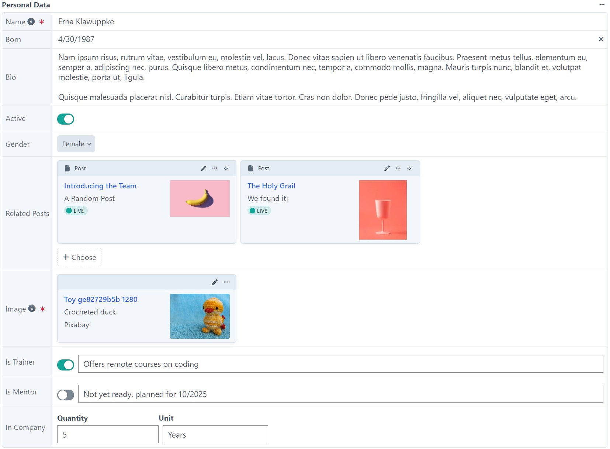
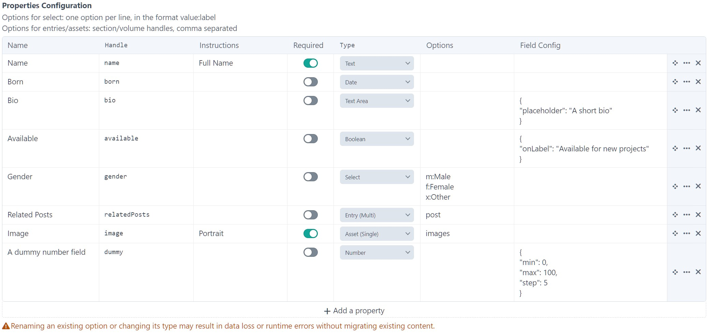
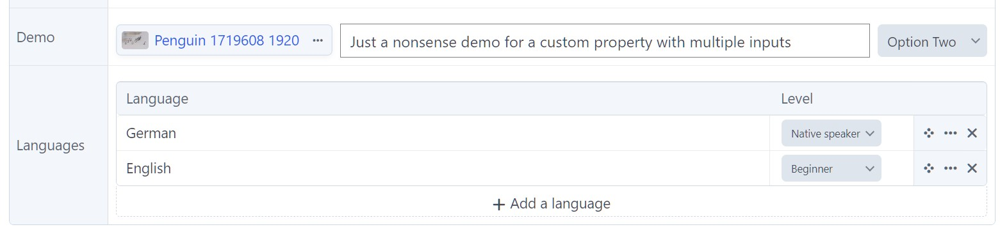

# Properties Field

Adds a properties field type

## Requirements

This plugin is tested with Craft CMS 5.7, and PHP 8.3.

## Installation

Add to `composer.json` file in your project root to require this plugin:

```json
{
  "require": {
    "wsydney76/craft-properties-field": "dev-main"
  },
  "minimum-stability": "dev",
  "prefer-stable": true,
  "repositories": [
    {
      "type": "vcs",
      "url": "https://github.com/wsydney76/craft-properties-field"
    }
  ]
}
```

Then run the following command to install the plugin:

```bash
ddev craft plugin/install _properties-field
```

## Motivation

Fill a gap in Craft CMS for a field type that allows you to define a set of properties for an element.

While the table field in static rows mode lacks support for restructuring content and different field types, the matrix
field doesn't provide a good UX for this purpose.

This is an extended version of a plugin used for years in a private project, updated to support more field types and
Craft 5 features.

These additions require a beta version of the plugin to be released, as they are not yet fully tested.

No warranty is given, and no support is provided.

Work in progress.

## Screenshots





````json
{
  "2563c798-42f7-493c-9bb8-9465a8355a72": {
    "bio": "Nam ipsum risus, rutrum vitae, vestibulum eu, molestie vel, lacus. Donec vitae sapien ut libero venenatis faucibus. Praesent metus tellus, elementum eu, semper a, adipiscing nec, purus. Quisque libero metus, condimentum nec, tempor a, commodo mollis, magna. Mauris turpis nunc, blandit et, volutpat molestie, porta ut, ligula.\r\n\r\nQuisque malesuada placerat nisl. Curabitur turpis. Etiam vitae tortor. Cras non dolor. Donec pede justo, fringilla vel, aliquet nec, vulputate eget, arcu.",
    "born": "1987-04-30T00:00:00+02:00",
    "name": "Erna Klawuppke",
    "image": "942",
    "active": "1",
    "gender": "f",
    "trainer": {
      "isOn": "1",
      "comment": "Offers remote courses on coding"
    },
    "inCompany": {
      "unit": "Years",
      "quantity": "5"
    },
    "mentoring": {
      "isOn": "",
      "comment": "Not yet ready, planned for 10\/2025"
    },
    "relatedPosts": [
      "5231",
      "5215"
    ]
  }
}
````

## Settings

### Plugin settings

* Show header: Whether to show a columns header in the CP. Defaults to `false`
* Date output format. Defaults to `short`
* Entries/Assets view mode. Defaults to `cards`
* Custom input template directory. See Extendingsection for more details.

### Field settings

A list of properties to be displayed in the field. Each property has the following settings:

* Name: The name of the property
* Handle: The handle of the property
* Placeholder: The placeholder for text properties
* Instructions: Instructions for the property, displayed in a popup via an `info` icon
* Required: Whether the property is required
* Type: The type of the property. The following types are supported:
    * Text: A single line text field
    * Textarea: A multi-line text field
    * Number: A number field
    * Email: An email field
    * Boolean: A boolean field (lightswitch)
    * Select: A select field with options
    * Date: A date field
    * Entry/Entries: An entries field with one or multiple entries
    * Asset/Assets: An assets field with one or multiple assets
    * Boolean with comment: A boolean field combined with a comment field (experimental)
    * Dimension: Combines a number field with a text field for the unit (experimental)
* Options: The options for the field. The following options are supported:
    * Select: A list of options for the select field, in the format `value:label`
    * Entry/Entries: A comma-separated list of section handles
    * Asset/Assets:  A comma-separated list of volume handles

## Limitations

* Only supports a limited set of field types
* Does not support all possible field settings
* Craft is not aware of sub-fields, so the whole field is marked as updated on changes, and a translation method can
  only be used for the whole field, not for sub-fields.

## Extending

The plugin can be extended by creating custom property types.

Examples:



```php
<?php

// config/_properties-field.php

return [
    'customInputTemplateDir' => '_properties-field-inputs',
    'extraPropertiesConfig' => [
        'demo' => [
            'label' => 'Demo',
            'type' => 'demo',
            'template' => '_properties-field-inputs/demo.twig',
        ],
        'languages' => [
            'label' => 'Languages',
            'type' => 'languages',
            'template' => '_properties-field-inputs/languages.twig',
        ]
    ],
];

```

Define twig templates inside the folder specified by `customInputTemplateDir` in the plugin settings.

The templates receive the following variables:

* `propertyConfig`: The property config, containing the name, handle, type, and options
* `value`: The value of the property, raw value as stored in the database
* `settings`: The plugin settings

Use multiple inputs with sub-keys for each input:

```twig


<div style="padding: 16px 8px 8px 8px; display: flex; align-items: center">
    <div>
        {{ forms.elementSelect({
            name: "#{propertyConfig.handle}[image]",
            elements: value['image'] ? craft.assets.id(value['image']).all : [],
            elementType: 'craft\\elements\\Asset',
            single: true,
            viewMode: 'list'
        }) }}
    </div>

    <div style="margin-left: 8px; width: 100%;">
        {{ forms.text({
            name: "#{propertyConfig.handle}[comment]",
            value: value['comment'] ?? '',
            placeholder: 'Comment'|t,
            class: 'text-combined',
            first: true
        }) }}
    </div>

    <div style="margin-left: 8px;">
        {{ forms.select({
            name: "#{propertyConfig.handle}[select]",
            value: value['select'] ?? '',
            options: [
                {label: 'Option One', value: 'one'},
                {label: 'Option Two', value: 'two'},
                {label: 'Option Three', value: 'three'},
            ],
            first: true
        }) }}
    </div>
</div>
```

Anything that is posted from fields is stored 'as is' in the database json field.

```twig


<div style="padding: 16px 8px 8px 8px; ">
    {{ forms.editableTable({
        id: propertyConfig.handle,
        name: propertyConfig.handle,
        addRowLabel: 'Add a language'|t,
        allowAdd: true,
        allowReorder: true,
        allowDelete: true,
        cols: {
            language: {heading: 'Language'|t, type: 'singleline'},
            level: {heading: 'Level'|t, type: 'select', width: '150px', options: [
                {label: 'Native speaker'|t, value: 'native'},
                {label: 'Expert'|t, value: 'expert'},
                {label: 'Beginner'|t, value: 'beginner'},
            ]}
        },
        rows: value
    }) }}
</div>
```

## Templating

The field value is an instance of `wsydney76\propertiesfield\models\PropertiesModel`

Access the properties directly:

```twig
entry.fieldHandle.properties

entry.fieldHandle.properties['handle']
```

However, this is not recommended, as this reflects the raw database content, where props may be missing or in a wrong
order, e.g. when the field config was updated after an entry was saved.

Loop over all properties:

```twig

        {{ prop.name }}:
        
        
            
                {{ entry.link }}
            
        
            {{ prop.normalizedValue.img({width: 200, height: 200}) }}
           
        ....
        
            {{ prop.normalizedValue }}
        

    
```

Each property is an array with the following keys:

* `name`: The name of the property
* `handle`: The handle of the property
* `type`: The type of the property
* `value`: The raw value of the property
* `normalizedValue`: The normalized value of the property, depending on the type:
    * `date`: A formated date string
    * `entry/asset`: A single element (or null)
    * `entries/assets`: An array of elements (or empty array)
    * `other`: The raw value

The config is available via the `config` property:

```twig
entry.fieldHandle.propertiesFieldConfig
```

A single property can be accessed via the sub-field handle:
These methods return an empty value if the property is not set in the database.

```twig
entry.fieldHandle.get('subfieldHandle') // raw value
entry.fieldHandle.getNormalized('subfieldHandle') // normalized value
```

Entries can be queried via the `hasProp()` entry query method:

```twig
.hasProp('entryTypeHandle', 'fieldHandle', 'subfieldHandle', 'value')



```

TODO: Allow querying for sub-keys.

The `Entry/Entries/Asset/Assets` sub-field types establish a relation, that can be queried via the `relatedTo` query
param

```twig

```

TODO: Check why `.relatedTo({targetElement: 5231, field: 'personalData'})` does not work.

This does not differentiate between the different sub-fields, so all entries selected by any sub-field are returned.

## Roadmap for beta.2

### Merged:

* 'Boolean with comment' property type
* 'Dimension' property type
* Allow customization of property types
* Load input field templates for property types dynamically

### Todo:

* Support 'required' setting for combined fields
* Support 'normalizedValue' for combined fields

