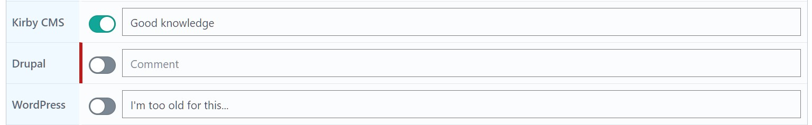
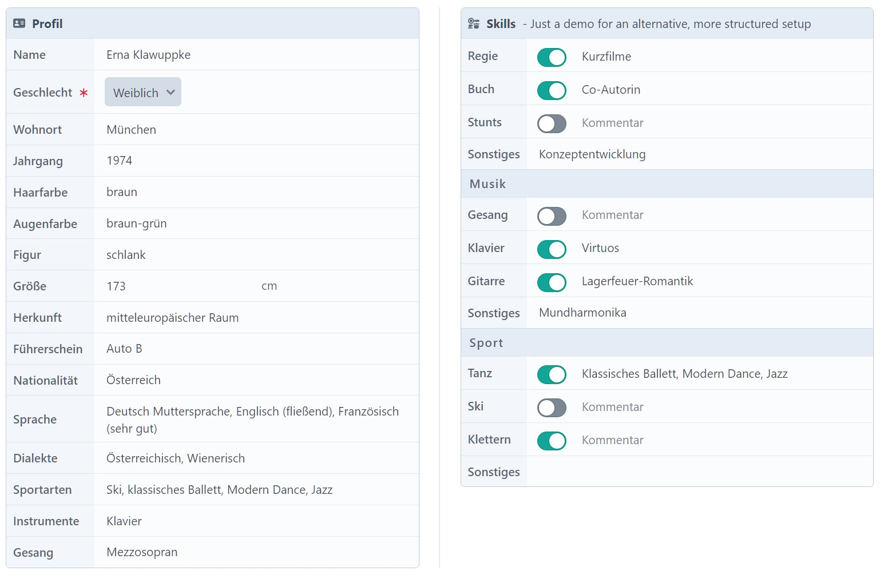
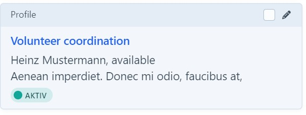
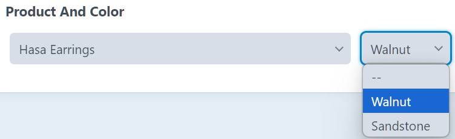
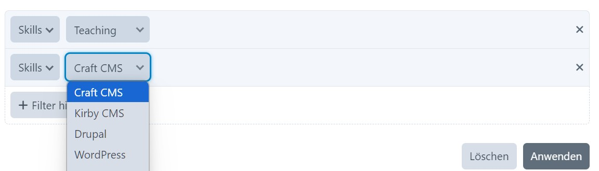

# Properties Field

Adds a properties field type

## Requirements

This plugin is tested with Craft CMS 5.7, MySql 8.0 and PHP 8.3.

## Version note

Feature freeze for now.

Tagged 1.0.0-beta.5 as an MVP (minimum viable product) version, and started testing and polishing the plugin in parallel
with the development of the project for which it is mainly intended.

Won't make sense to push every minor tweak, so we will share a first final version in a couple of weeks (or months...).

## Installation

Add to `composer.json` file in your project root to require this plugin:

Use version `^1.0.0-beta.5` for 'official' releases, or `dev-main` for the latest development version, where anything
can go wrong.

```json
{
  "require": {
    "wsydney76/craft-properties-field": "dev-main"
  },
  "minimum-stability": "dev",
  "prefer-stable": true,
  "repositories": [
    {
      "type": "vcs",
      "url": "https://github.com/wsydney76/craft-properties-field"
    }
  ]
}
```

Then run the following commands to install the plugin:

```bash
ddev composer update
ddev craft plugin/install _properties-field
```

## Motivation

Fill a gap in Craft CMS for a field type that allows you to define a set of properties for an element.

While the table field in static rows mode lacks support for restructuring content and different field types, the matrix
field doesn't provide a good UX for this purpose. Craft also has limited support for organizing a field layout in real
columns.

This is an extended version of a plugin used for years in a private project, updated to support more field types and
Craft 5 features.

These additions require a beta version of the plugin to be released, as they are not yet fully tested.

No warranty is given, and no support is provided.

Work in progress. Not tested in a multi-site environment.

## Screenshots

### Standard fields


### Custom header / Custom properties


### Use in a matrix block


### Group headers and multi-sub-fields properties


This kind of setup is actually one of the main use cases for this plugin, as it allows to add/remove/rearrange
properties consistently without creating a myriad of fields/matrix blocks.

If enabled in the field settings, newly added properties that are missing in the database are marked by a red border, so
that the editor can easily spot them.



See the [Templating](#templating) section for more details on how to output/search this in your templates.

### Side by side

Enable a compact author-friendly layout.



## Storage

The field stores the data posted from the edit form "as-is" in a JSON field (just date fields are converted to ISO
format).

This means that all values are stored as strings, including numbers and element ids. Lightswitch values are stored as
`"1"` or `""`, dates are stored in ISO format.

````json
{
  "2563c798-42f7-493c-9bb8-9465a8355a72": {
    "bio": "Nam ipsum risus, rutrum vitae, vestibulum eu, molestie vel, lacus. Donec vitae sapien ut libero venenatis faucibus. Praesent metus tellus, elementum eu, semper a, adipiscing nec, purus. Quisque libero metus, condimentum nec, tempor a, commodo mollis, magna. Mauris turpis nunc, blandit et, volutpat molestie, porta ut, ligula.\r\n\r\nQuisque malesuada placerat nisl. Curabitur turpis. Etiam vitae tortor. Cras non dolor. Donec pede justo, fringilla vel, aliquet nec, vulputate eget, arcu.",
    "born": "1987-04-30T00:00:00+02:00",
    "name": "Erna Klawuppke",
    "image": "942",
    "active": "1",
    "gender": "f",
    "trainer": {
      "isOn": "1",
      "comment": "Offers remote courses on coding"
    },
    "inCompany": {
      "unit": "Years",
      "quantity": "5"
    },
    "mentoring": {
      "isOn": "",
      "comment": "Not yet ready, planned for 10\/2025"
    },
    "relatedPosts": [
      "5231",
      "5215"
    ]
  }
}
````

Just in case: The field can be safely converted to the Craft 5.7 JSON field type without data loss.

## Settings

### Plugin settings

* Date output format. Defaults to `short`
* DateTime output format. Defaults to `short`
* Currency: The default currency for money fields. Defaults to `EUR`
* Entries/Assets view mode. Defaults to `cards`
* Custom template directory. Registers a template root in the `cp` template mode, that can be used for custom property
  types inputs or previews. You can leave this blank if your project registers its own template root.

### Field settings

Color: The background color of group headers and property labels. Defaults to `no color` (aka gray)

Icon/Heading/Additional heading text: Display a title row with an icon and a heading. Works best if the field name is
hidden in the entry type's field layout.

Property types configuration: A list of properties to be displayed in the field. Each property has the following
settings:

* Name: The name of the property
* Handle: The handle of the property (will be built from the name if not set)
* Instructions: Instructions for the property, displayed in a popup via an `info` icon
* Required: Whether the property is required
    * For type `Boolean with comment`, a comment must be provided if the boolean is on.
    * For type `Dimension`, a quantity must be provided.
* Search: Whether the property value should be searchable.
* Type: The type of the property. The following types are supported:
    * Group header: A group header text
    * Text: A single line text field
    * Textarea: A multi-line text field
    * Number: A number field
    * Money: A money field
    * Range: A range field
    * Email: An email field
    * URL: An URL field.
    * Boolean: A boolean field (lightswitch)
    * Select: A select field with options
    * Radio: A radio field with options
    * Checkboxes: A checkbox field with options
    * Multiselect: A multi-select field with options
    * Date: A date field
    * DateTime: A date/time field
    * Entry/Entries: An entries field with one entry or multiple entries
    * Entry Select/Entries Select: A select field with one entry or multiple entries. Allows to select an entry without
      opening the selection modal.
    * Asset/Assets: An assets field with one asset or multiple assets
    * Country: A country field
    * Boolean with comment: A boolean field combined with a comment field (experimental)
    * Table: A table field with configurable columns, incl. entry selection (experimental). See the Table property type
      section below.
    * Dimension: Combines a number field with a text field for the unit (experimental)
    * Dynamic property set. See 'Dynamic property config' below.
* Options: The options for the field. The following options are supported:
    * Select: A list of options for the select field, in the format `value:label`
    * Entry/Entries: A comma-separated list of section handles
    * Entry Select: Query conditions in JSON format, e.g.:
        * `{"section": "person", "orderBy": "lastName, firstName"}`
    * Asset/Assets:  A comma-separated list of volume handles
    * Dynamic property set: The slug of the entry that holds the property set. See 'Dynamic property config' below.
* Field Config: A JSON string with additional field config settings. (Tip: This is hard to edit in the CP, so use a json
  editor (like PhpStorms scratch files) and copy/paste it into the field config box.)

  This is merged into the field config object of the corresponding Craft forms macro, so you can use any settings
  supported by the field type. For example:
    * `{"placeholder": "placeholder text"}` for a text field
    * `{"offLabel": "labelText","onLabel": "labelText"}` for a boolean field
    * `{"min": 0,"max": 100,"step": 5, "suffix": "cm"}` for a number field
    * `{"currency": "USD"}` for a money field

  Supported for property types with a single input macro.

Enable missing property marker: If enabled, a red border is displayed around properties that are missing in the
database. This is useful for
editors to spot properties that need to be set.

Hide labels: If enabled, the property labels are hidden in the field input. 
This is especially useful for fields that only contain custom property types that are self-explanatory.

Preview template: A twig template that is used to render the preview of the property. This is used for a element index
columns and cards. See preview section below.

Tip/Warning: Show a tip/warning. This allows to have consistent settings across all usages. Unlike instructions,
tips/warnings added in a field layout do not override the field settings.

## Defaults

Intentionally, there is no setting for a default value. This is because we want the field to be used in a way that the
properties are always explicitly set by the editor, rather than relying on a random default value.

In case you can't resist, there is an experimental CLI command included that lets you set a value for a property, where
it is not already set.

```bash
craft _properties-field/set-default entryTypeHandle fieldHandle propertyHandle value
```

Handles only scalar values for now.

For recurring workflows, like adding a new 'skill', you may think of a utility that allows to bulk update the property
for all relevant entries at once.

## Table property type

Experimental, work in progress.

The table property type allows to define a table with a configurable number of columns.


By default, a table with a single `text` column is created.

The `Field Config` setting allows to define the columns of the table. This is a JSON string with settings that Craft's
`editableTable`form macro accepts.

Additionally, instead of providing a static `options` array for the `select` column type, you can provide a pseudo
`entrySelect/productSelect` column type with a `criteria` key with query conditions in JSON format.
This will dynamically build options with the element id as value and the element title as label.

```json
{
  "addRowLabel": "Add a team member",
  "cols": {
    "entry": {
      "heading": "Entry",
      "type": "entrySelect",
      "width": "150px",
      "criteria": {
        "section": "person",
        "orderBy": "title"
      }
    },
    "active": {
      "heading": "Active",
      "type": "lightswitch",
      "width": "100px"
    },
    "comment": {
      "heading": "Comment",
      "type": "singleline"
    }
  }
}
```

Currently, there is no helper function implemented for querying the table property type, but it can be achieved with raw
SQL:

Search for exact value:

```twig

```

Search with wildcards:

```twig
{% set ids = craft.query
    .select('elementId')
    .from("{{%elements_sites}},
     JSON_TABLE(
             content->'$.\"7213a17c-6c25-4d0e-9795-cd1adea13db4\".team',
             '$[*]' COLUMNS (
                 col_value VARCHAR(255) PATH '$.comment'
                 )
     ) AS jt")
    .where("col_value LIKE '%Team%'")
    .andWhere("siteId = #{currentSite.id}")
.column %}


```

(Query AI generated...)

## Dynamic property config

Experimental, work in progress.

Updating the property types config in a custom field settings updates the project config, which means that a deployment
action is needed to get this 'live'.

This will fit in most cases, especially when updating the config also requires changes in your templates.

However, sometimes a more dynamic approach is needed, allowing privileged editors to change the property config in the
database without touching the project config.

Take the 'Skills' example from the screenshots above. This is a list of skills that can be added/removed/rearranged by
the editor, and can be output via a generic template.

Experimental approach:

* Enable the `Enable dynamic property config` setting in the field settings.
* Create a custom field with the type `Properties Set`. (This is just a table field with default settings, matching the
  plugin's field type settings.)
* Create a new section/entry type with a field layout containing that field, where the handle matches the
  `Field handle for dynamic properties` setting. Defaults to `propertiesSet`.
* Create a new entry in this section, and add the properties you want to use.
* In the fields settings, create a property type with the type `Dynamic property set` and the slug of the entry that
  holds the property set.
* This will load the configs from the entry and insert them at that position.

## Templating

The field value is an instance of `wsydney76\propertiesfield\models\PropertiesModel` (or null if not set).

### Access the raw values:

```twig
entry.fieldHandle.properties

entry.fieldHandle.properties['handle']
```

However, this is not recommended, as this reflects the raw database content, where props may be missing or in a wrong
order, e.g. when the field config was updated after an entry was saved.

So always code defensively and check for the existence or type of property before using it.

### Access via JsonData

Starting with Craft 5.7, you can access the configured properties via the `JsonData` class, which allows to use the same
methods as
for the standard Craft JSON field (
see [Docs](https://craftcms.com/docs/5.x/reference/field-types/json.html#development)).

```twig

```

Properties that are not set in the database are will have a `null` value.

### Access the normalized values:

```twig

Loop over all properties:

```twig

        {{ prop.name }}:
        
        
            
                {{ entry.link }}
            
        
            {{ prop.normalizedValue.img({width: 200, height: 200}) }}
           
        ....
        
            {{ prop.normalizedValue }}
        

    
```

__Ignore missing/empty properties:__

This is especially helpful if new properties are added to the field config, and explicit values are not yet saved.

```twig

   ...
    
```

Ignores properties that are not in the database. Uses `isset()` internally.

```twig

   ...
    
```

Ignores properties that have an empty value. Uses `empty()` internally.

TODO: Check, what 'empty' means for the different property types. This may work currently as expected for property types
that return a scalar value.

Alternatively, you can check the raw value of the property, `prop.value` will be `null` if the property is not in the
database.

__Set a default value for empty properties:__

```twig

   ...
    
```

The normalized value can be changed via an event handler.

```php
Event::on(
    PropertiesModel::class,
    PropertiesModel::EVENT_GET_NORMALIZED_VALUE,
    function(GetNormalizedValueEvent $event) {
        if (
            $event->value &&
            $event->element->section->handle == 'volunteer' &&
            $event->field->handle == 'personalData' &&
            $event->propertyConfig['handle'] == 'birthday') {
            $event->normalizedValue = substr($event->value, 0, 4);
        }
    });
```

If the property is not set in the database, `prop.value` will be the default value. `prop.normalizedValue` will depend
on the type of the property (e.g. null for element selects).

Each property is an array with the following keys:

* `name`: The name of the property
* `handle`: The handle of the property
* `type`: The type of the property
* `value`: The raw value of the property
* `normalizedValue`: The normalized value of the property, depending on the type:
    * `date/datetime`: A formated date string
    * `entry/asset/entrySelect/product/productSelect`: A single element (or null)
    * `entries/assets/entriesSelect/products/productsSelect`: An array of elements (or empty array)
    * `select/radio`: An instance of `craft\fields\data\SingleOptionFieldData`. See Craft CMS documentation of the
      Dropdown
      field for more details.
    * `checkboxes/multiselect`: An instance of `craft\fields\data\MultiOptionsFieldData`. See Craft CMS documentation of
      the Multiselect
      field for more details
    * `country`: A `country` model. See Craft CMS documentation of the Country field for more details.
    * `money`: A `money` model, that can be formatted with the `money` filter. See Craft CMS documentation of the Money
      field for more details.
    * `boolean with comment`: A string with (translated) Yes/No, and a comment string, e.g. `Yes (Expert level)`
    * `other`: The raw value

The config is available via the `propertiesFieldConfig` property:

```twig
entry.fieldHandle.propertiesFieldConfig

craft.app.fields.byHandle('fieldHandle').propertiesFieldConfig

```

A single property can be accessed via the sub-field handle:
These methods return an empty value if the property is not set in the database.

```twig
entry.fieldHandle.get('subfieldHandle') // raw value
entry.fieldHandle.getNormalized('subfieldHandle') // normalized value
```

## Preview

A preview template for a field can be defined in the field settings. This is used for element index columns and cards.



The template receives the following variables:

* `element`: The element object
* `value`: The field value

Value will be an instance of `PropertiesModel` (index column or card) or `null` (field layout card designer).

Example:

```twig

    {{ value.get('name') }}, {{ value.get('available') ? 'available'|t : 'unavailable'|t }}
   <br>
    {{ value.get('bio') }}

    Sabine Mustermann, available<br>
    short bio...

```

## Querying

The standard Craft way of querying for custom field values does not work out of the box, as the field is stored in a
JSON format with multiple sub-fields, representing not just 'one' value, but 'a set of values'.

As a workaround, the plugin provides a set of query methods that can be used to query for entries with specific
property values.

* Enable the `Enable element query helpers` setting.
* A properties field can be accessed in the form `entryTypeHandle.fieldHandle` or `fieldHandle` if the field is used in
  multiple entry types.

### Query methods

The following query methods are available via a behavior:

* `propEquals()` (for scalar values, uses `=` in the SQL query)
* `propLike()` (for scalar values, uses `LIKE` in the SQL query)
* `propContains()` (for array elements, e.g. entries/assets property types)
* `propIsOn()` (for 'Boolean with comment' property type)

```twig
.propEquals('entryTypeHandle.fieldHandle', 'subfieldHandle', 'value')
.propEquals('fieldHandle', 'subfieldHandle', 'value')













```

### Advanced queries

Experimental, work in progress.

A `propValueSql(fieldIdent, prop [, cast])` method is available in twig that returns a SQL string that can be used in a
query (`PropertiesFieldHelper::propValueSql()` for PHP).

* `propValueSql('propertiesFilm.filmProps', 'seasonEpisode.season')` =>
  `JSON_UNQUOTE(JSON_EXTRACT(content, '$."1cdf8ca4-f462-4ab7-a19a-9a2df1ee1bba".seasonEpisode.season'))`
* `propValueSql('propertiesFilm.filmProps', 'seasonEpisode.episode', 'SIGNED')` =>
  `CAST(JSON_UNQUOTE(JSON_EXTRACT(content, '$."1cdf8ca4-f462-4ab7-a19a-9a2df1ee1bba".seasonEpisode.episode')) AS SIGNED)`
* `propValueSql('profile', 'seasonEpisode.episode')` =>
  `COALESCE(JSON_UNQUOTE(JSON_EXTRACT(content, '$."79e7fc9f-5cff-41c5-bbd3-c5dff87e34f4".name')), JSON_UNQUOTE(JSON_EXTRACT(content, '$."6d9b91f3-ffac-450b-ba63-3a632a1b1dd1".name')))`

Usage example:

```twig



 
```

You may need to use the `expression()` function to avoid incorrect escaping.

### Preparse fields

If you want to execute more advanced queries on a sub-field,
the [Preparse plugin](https://github.com/jalendport/craft-preparse) can be used.

E.g. for querying a number field, you can create a new preparse field with the number value, and then use
`{{ element.fieldHandle.get('propertyHandle') }}` for the `Twig code to parse` setting. Make sure values are converted
to the correct type depending on the `column type` setting.

Now the sub-field can be queried like a normal field:

```twig

```

### Hardcoded SQL

The UID under which the data of a properties field is stored in Craft's content column is part of the project config, so
it does not change between environments.

So it feels safe to hard code the SQL statements, if you prefer that.

```twig

```

Look in `/config/project/entrytypes/yourEntryType-....yaml` for
`fieldlayouts > [fieldLayoutUid] > tabs > elements > yourField > uid`

## Relations

The `Entry/Entries/Asset/Assets` sub-field types establish a relation, that can be queried via the `relatedTo` query
param

```twig

```

This does not differentiate between the different sub-fields, so all entries selected by any sub-field are returned.

Using the field param like in `.relatedTo({targetElement: 5231, field: 'personalData'})` will not work.
Craft only supports this for fields extending `BaseRelationField`.

Use `propContains()` instead.

## GraphQL

Like Craft's native [JSON fields](https://craftcms.com/docs/5.x/reference/field-types/json.html#graphql), Property
fields are treated like plain strings, when queried via GraphQL. Values must be deserialized in the client or app.

## Examples: Handling "Boolean with comment" property type

See screenshot of the 'Skills' example above

Output a list of skills:

```twig
<table class="w-full">
    
        <tr>
            <td>
                {{ prop.name }}
            </td>
            <td class="text-right">
                {{ prop.normalizedValue }}
            </td>
        </tr>
    
</table>
```

Get a comma-separated list of skills (for use in listings, cards, etc.):

```twig



    
        
    

{{ out|join(', ') }}
```

Build a search form:

```twig


<form>
...
<div class="columns-4">
    
        <label for="skill-{{ prop.handle|id }}">
            <input id="skill-{{ prop.handle|id }}"
                   type="checkbox"
                   name="skills[{{ prop.handle }}]"
                   checked
            >
            {{ prop.name }}
        </label>
        <br>
    
</div>
...
</form>
```

Build the query:

```twig




    


```

## Extending

The plugin can be extended by creating custom property types.

Examples:


### Configuring custom property types

```php
<?php

// config/_properties-field.php

use modules\main\properties\MyPropertiesModel;

return [
    'customTemplateDir' => '_properties-field-inputs',
    'extraPropertyTypes' => [
        'demo' => [
            'label' => 'Demo',
            'type' => 'demo',
            'template' => '_properties-field-inputs/demo.twig',
            'onNormalize' => [MyPropertiesModel::class, 'normalizeDemo'], // Optional, see callbacks section below
            'onValidate' => [[MyPropertiesModel::class, 'validateDemo']], // Optional, see callbacks section below
            'onDefineKeywords' => [[MyPropertiesModel::class, 'keywordsDemo']], // Optional, see callbacks section below
            'onConstruct' => [MyPropertiesModel::class, 'constructInCinemas'], // Optional, see callbacks section below
        ],
        'productWithColor' => [
            'label' => 'Product with Color',
            'type' => 'productWithColor',
            'template' => '_properties-field-inputs/productWithColor.twig',
            'isRelation' => true, // Update relations table
            'relationSubKeys' => ['product', 'color'], // subkeys that contain element ids
            'onNormalize' => [MyPropertiesModel::class, 'normalizeProductAndColor'], // Optional, see callbacks section below
            'onValidate' => [[MyPropertiesModel::class, 'validateProductAndColor']], // Optional, see callbacks section below
            ...
        ]
    ],
];

```

### Templating custom property types input

Define twig templates inside the folder specified by `customTemplateDir` in the plugin settings.

The templates receive the following variables:

* `propertyConfig`: The property config, containing the name, handle, type, and options
* `value`: The value of the property, raw value as stored in the database
* `settings`: The plugin settings

Use multiple inputs with sub-keys for each input:

```twig


<div style="padding: 16px 8px 8px 8px; display: flex; align-items: center">
    <div>
        {{ forms.elementSelect({
            name: "#{propertyConfig.handle}[image]",
            elements: value['image'] ? craft.assets.id(value['image']).all : [],
            elementType: 'craft\\elements\\Asset',
            single: true,
            viewMode: 'list'
        }) }}
    </div>

    <div style="margin-left: 8px; width: 100%;">
        {{ forms.text({
            name: "#{propertyConfig.handle}[comment]",
            value: value['comment'] ?? '',
            placeholder: 'Comment'|t,
            class: 'text-border',
            first: true
        }) }}
    </div>

    <div style="margin-left: 8px;">
        {{ forms.select({
            name: "#{propertyConfig.handle}[select]",
            value: value['select'] ?? '',
            options: [
                {label: 'Option One', value: 'one'},
                {label: 'Option Two', value: 'two'},
                {label: 'Option Three', value: 'three'},
            ],
            first: true
        }) }}
    </div>
</div>
```

Example: 

Dynamically update available colors for a selected product.



```twig






   


<div style="display: flex; ">
    <div style="">
        {{ forms.selectize({
            id: "pc_product",
            name: "#{propertyConfig.handle}[product]",
            options: productOptions,
            value: value['product'] ?? null,
            inputAttributes: {
                onChange: 'pc_getColor(this)',
                allowEmptyOption: true,
                showEmptyOptionInDropdown: true,
            }
        }) }}
    </div>


    
    

        
        
            
        
    

    

    <div style="margin-left: 12px;">

        {{ forms.select({
            id: "pc_product_color",
            name: "#{propertyConfig.handle}[color]",
            options: colorOptions,
            value: value['color'] ?? null,
        }) }}

    </div>
</div>


function pc_getColor(select) {

    if (!select.value) {
        // Happens if selectize is first clicked
        return;
    }

    const colorSelect = document.getElementById(select.id + '_color');

    fetch(`/actions/shop/products/get-color?productId=${select.value}`)
        .then(response => response.json())
        .then(data => {
            console.log(data);

            colorSelect.innerHTML = ''; // Clear existing options
            colorSelect.add(new Option('---', ''));
            data.colors.forEach(({ value, label }, index) => {
                const option = new Option(label, value);
                colorSelect.add(option);
                if (index === 0 && value) {
                    colorSelect.value = value; // Select the first non-empty option
                }
            });
        })
        .catch(error => {
            console.error('Error fetching colors:', error);
        });
}

```

Anything that is posted from fields is stored 'as is' in the database json field.

### Callbacks for custom property types

The config can define callbacks for the `onNormalize`, `onValidate`, `onConstruct` and `onDefineKeywords` methods.

```php
<?php

namespace modules\main\properties;

use Craft;
use craft\base\ElementInterface;
use wsydney76\propertiesfield\fields\Properties;

class MyPropertiesModel
{
    public static function normalizeDemo(mixed $value): mixed
    {
        return 'A dummy demo text';
    }

    public static function validateDemo(ElementInterface $element, Properties $field, array $property, mixed $value): void
    {
        if (... validation fails ...) {
            $element->addError($field->handle, $field->name . '/' . $property['name'] . ': ' . Craft::t('site', 'Demo went wrong.'));
        }
    }
    
    // save dates in ISO format
    public static function constructInCinemas(array $property, array $propertyConfig): array
    {
        if (isset($property['from']) && is_array($property['from'])) {
            $property['from'] = DateTimeHelper::toIso8601($property['from']);
        }

        if (isset($property['to']) && is_array($property['to'])) {
            $property['to'] = DateTimeHelper::toIso8601($property['to']);
        }

        return $property;
    }
    
    public static function keywordsDemo($normalizedValue, $config, $rawData): string
    {
        return $rawData['comment'];
    }
}
```

## Migrations:

### Changing subkey handles

Intentionally, the sub keys are the handles of the properties, not a UID. Which means, changing the handle of a property
in the field requires a content migration.

There is an experimental CLI command included, that can be used to update the content in the database.

```bash
craft _properties-field/change-handle entryTypeHandle fieldTypeHandle oldPropertyHandle newPropertyHandle
```

It runs SQL like this to update the content in the database:

```mysql
UPDATE elements_sites
SET content = JSON_REMOVE(
        JSON_SET(
                content,
                '$."26a389ed-ea3a-45f9-9f7f-fed91b9896b8"."newHandle"',
                JSON_EXTRACT(content, '$."26a389ed-ea3a-45f9-9f7f-fed91b9896b8"."oldHandle"')
        ),
        '$."26a389ed-ea3a-45f9-9f7f-fed91b9896b8"."oldHandle"'
              )
WHERE JSON_CONTAINS_PATH(content, 'one', '$."26a389ed-ea3a-45f9-9f7f-fed91b9896b8"."oldHandle"');
```

## Condition rules

The plugin does not support condition rules out of the box because the field setup is too complex to be handled.

However, you can provide custom condition rules for your project.



Registration:

```php
Event::on(BaseCondition::class,
    BaseCondition::EVENT_REGISTER_CONDITION_RULES,
    function(RegisterConditionRulesEvent $event) {
        $event->conditionRules[] = SkillsConditionRule::class;
    });
```

Example condition rule class:

```php
<?php

namespace modules\main\elements\conditions;

use Craft;
use craft\base\conditions\BaseSelectConditionRule;
use craft\base\ElementInterface;
use craft\elements\conditions\ElementConditionRuleInterface;
use craft\elements\db\ElementQueryInterface;
use craft\elements\Entry;

/**
 * Skills Condition Rule element condition rule
 */
class SkillsConditionRule extends BaseSelectConditionRule implements ElementConditionRuleInterface
{
    function getLabel(): string
    {
        return 'Skills';
    }

    function getExclusiveQueryParams(): array
    {
        return [];
    }

    function modifyQuery(ElementQueryInterface $query): void
    {
        $query->propIsOn('propertiesSkills.skills', $this->value);
    }

    function matchElement(ElementInterface $element): bool
    {
        return Entry::find()
            ->id($element->id)
            ->status(null)
            ->provisionalDrafts(null)
            ->drafts(null)
            ->propIsOn('propertiesSkills.skills', $this->value)
            ->exists();
    }

    protected function options(): array
    {
        $field = Craft::$app->getFields()->getFieldByHandle('skills');
        return collect($field->propertiesFieldConfig)
            ->filter(fn($skill) => $skill['type'] === 'extendedBoolean')
            ->map(fn($skill) => [
                'value' => $skill['handle'],
                'label' => $skill['name'],
            ])
            ->toArray();
    }
}

```

## Limitations

* Only supports a limited set of field types
* Does not support all possible field settings
* Craft is not aware of sub-fields, so the whole field is marked as updated on changes.
* A translation method can only be used for the whole field, not for sub-fields.
* No out-of-the-box validation for sub-fields.
* No fancy UI for extended sub-field settings.
* Does not support conditional logic for sub-fields out of the box.
* Eager loading of elements is not supported.
* Does not support standard Craft queries for custom fields.
* Not tested with Postgres database.

Regarding translated content:

* Supports `Copy value from other site` for the whole field.
* Idea: if the field is translatable, making single sub-fields 'not translatable' could be achieved by syncing the
  values via hooking into save events.
  See experimental event handler below.

### Setting property values

A property value can be set programmatically via the `PropertiesFieldHelper::updateProperty` method:

```php
PropertiesFieldHelper::updateProperty(
    $element,
    $fieldHandle,
    $propertyHandle,
    $value
)
```

Does not support nested properties yet.

## Event handlers

If the field as a whole is translatable, but some sub-fields should be 'not translated', you might use something like
the following event handler to sync the values.

Intentionally vague, the project this is mainly developed for are not multi-site, so this is just a first experiment.

In a 'skills' setup as shown in the screenshots, the 'isOn' value of the skills should be synced between the different
sites, but the textual comment are language specific.

Trial and error, tbh. I don't fully understand what Craft is doing...

```php
// In a custom module

private array $skills = [];

private function attachEventHandlers(): void
{
    Event::on(
        Entry::class,
        Element::EVENT_BEFORE_SAVE,
        function(ModelEvent $event) {
            /** @var Entry $entry */
            $entry = $event->sender;

            if (!$entry->section ||
                $entry->section->handle !== 'person' ||
                !ElementHelper::isDraft($entry) ||
                $entry->resaving
                // whatever else...
            ) {
                return;
            }

            if (!$entry->propagating) {
                // This is the first event in sequence, save the current skills for subsequent events
                $this->skills = $entry->skills->properties;
            } else {
                $entry->skills = $this->updateIsOn($this->skills, $entry->skills->properties);
            }
        }
    );
}

private function updateIsOn(array $source, array $target): array
{
    foreach ($source as $key => $sourceValue) {
        if (isset($target[$key])) {
            $target[$key]['isOn'] = $sourceValue['isOn'] ?? '';
        }
    }
    return $target;
}
```
